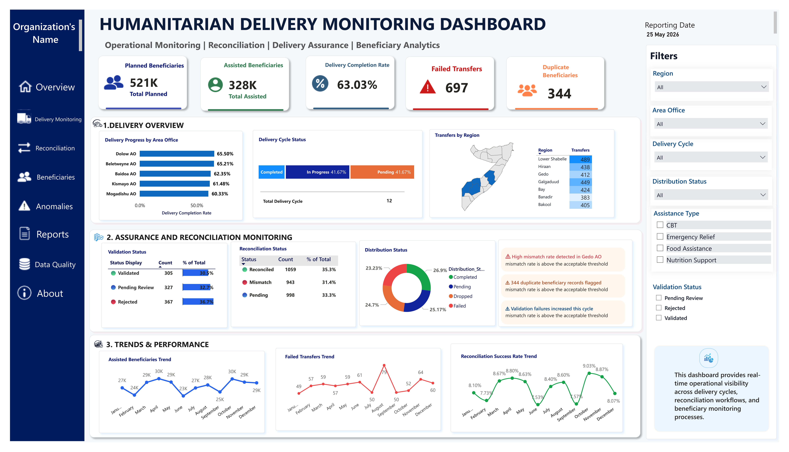

# Humanitarian Delivery Monitoring Dashboard

<p align="center">
  
</p>

## Executive Summary

Humanitarian operations require timely, accurate, and actionable information to ensure assistance reaches the right people at the right time. Delays in delivery cycles, transfer failures, duplicate records, and reconciliation gaps can directly affect programme performance and accountability.

This project presents an executive-level delivery monitoring dashboard designed to provide operational visibility across humanitarian assistance processes. Using simulated datasets inspired by real humanitarian workflows, the dashboard supports beneficiary monitoring, delivery assurance, reconciliation oversight, and performance tracking through a single decision-support interface.

The objective was not simply to build a dashboard, but to demonstrate how operational data can be transformed into insights that enable programme teams to identify risks early, monitor implementation progress, and strengthen accountability.

---

## Dashboard Preview

### Delivery Monitoring Dashboard


---

## Business Problem

Programme teams often rely on multiple systems and reports to understand the status of assistance delivery. This fragmentation can make it difficult to answer critical operational questions such as:

- How many beneficiaries were planned versus assisted?
- Which delivery cycles require attention?
- Which Area Offices are underperforming?
- Are transfer failures increasing?
- Are reconciliation issues emerging?
- Are validation anomalies affecting programme integrity?

Without a consolidated view, identifying operational risks and responding in a timely manner becomes challenging.

---

## Solution

This dashboard consolidates key operational indicators into an executive reporting interface that enables users to:

### Monitor Delivery Performance
- Planned beneficiaries
- Assisted beneficiaries
- Delivery completion rates
- Failed transfers
- Delivery cycle progress

### Strengthen Operational Assurance
- Validation status monitoring
- Reconciliation tracking
- Distribution status analysis
- Operational alert notifications

### Support Decision-Making
- Area Office comparisons
- Regional delivery analysis
- Monthly trend monitoring
- Early identification of anomalies

---

## Key Features

### Executive KPI Monitoring
The dashboard provides immediate visibility into high-level operational indicators, including:

- Planned Beneficiaries
- Assisted Beneficiaries
- Delivery Completion Rate
- Failed Transfers
- Duplicate Beneficiary Records

---

### Delivery Overview

Provides insight into implementation progress through:

- Delivery completion rates by Area Office
- Delivery cycle status tracking
- Geographic distribution analysis

This enables management teams to quickly identify locations requiring follow-up.

---

### Assurance and Reconciliation Monitoring

Designed to support programme integrity by highlighting:

- Validation outcomes
- Reconciliation status
- Distribution performance
- Emerging operational risks

Dynamic alert messages draw attention to anomalies requiring further investigation.

---

### Trends and Performance

Supports forward-looking analysis through monthly trends including:

- Assisted beneficiary trends
- Failed transfer patterns
- Reconciliation success rates

Trend analysis helps identify recurring issues and opportunities for operational improvement.

---

## Data Model

The dashboard was built using a relational data model inspired by humanitarian operational workflows.

### Tables

#### Beneficiaries
Master beneficiary information including demographic and validation attributes.

#### Transfers
Assistance transactions and distribution outcomes.

#### Delivery Cycles
Programme cycle timelines and implementation status.

#### Validation Logs
Validation outcomes and operational review records.

#### Area Offices
Reference information used for regional and office-level reporting.

---

## Data Modelling Approach

A star-schema-inspired design was implemented to improve model efficiency and reporting performance.

Relationships were established using one-to-many cardinality to support scalable analysis and filter propagation.

### Relationship Structure

```
Area Offices
      |
Beneficiaries
   /        \
Transfers   Validation Logs
     |
Delivery Cycles
```

---

## DAX Measures

Key measures developed for this dashboard include:

- Total Beneficiaries
- Total Transfers
- Total Planned Assistance
- Total Delivered Assistance
- Delivery Completion Rate
- Failed Transfers
- Duplicate Beneficiaries
- Reconciliation Mismatches

These measures provide the analytical foundation for executive reporting and operational monitoring.

---

## Tools and Technologies

- Power BI Desktop
- DAX
- Power Query
- Excel
- Data Modelling
- Humanitarian Operational Analytics

---

## Operational Relevance

Although developed using simulated datasets, the dashboard reflects analytical concepts commonly encountered in humanitarian contexts, including:

- Delivery cycle monitoring
- Beneficiary assurance
- Validation oversight
- Reconciliation tracking
- Operational performance reporting
- Anomaly identification
- Decision-support analytics

The project demonstrates how data can be leveraged to strengthen accountability and improve programme implementation.

---

## Repository Structure

```
humanitarian-delivery-monitoring-dashboard/
│
├── README.md
├── Humanitarian Delivery Monitoring Dashboard.pbix
├── screenshots/
├── documentation/
├── datasets/
└── data-model/
```

---

## Disclaimer

This project was developed solely for portfolio and educational purposes.

The datasets used are simulated and were designed to resemble humanitarian operational workflows. No confidential information, beneficiary records, or proprietary organisational data from WFP, FAO, or any other entity has been used.

---

## About the Author

**Ibrahim Abdirahman**

Humanitarian Data Analyst with experience in operational analytics, beneficiary validation, dashboard reporting, and humanitarian delivery systems. Passionate about transforming complex operational data into actionable insights that support evidence-based decision-making and strengthen humanitarian programme delivery.

GitHub: https://github.com/Ibrahim-abdirahman

Portfolio: https://ibrahim-abdirahman.github.io/
